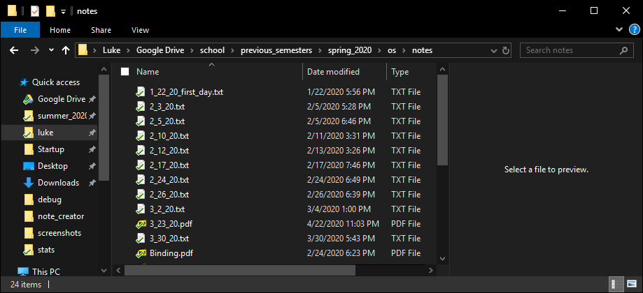

# Note Creator

---

- [Note Creator](#note-creator)
  - [Installation](#installation)
  - [How To Use](#how-to-use)
  - [How to build from source](#how-to-build-from-source)
  - [To Do](#to-do)
  - [Bugs](#bugs)
  - [Credit](#credit)
  - [License](#license)

---

## Installation

1. Download `.zip` file from the [release page](https://github.com/LewkyB/Note_Creator/releases/tag/1.0).
2. Unzip the `release` folder.
3. open `note_creator.exe`

---

## How To Use

I wanted to make it easier creating `.txt` and `.md` files for taking notes in for class. The way I keep up with school is having a folder for each class.

This program allows you to save multiple directories as favorites then create and open files inside those favorite directories.

In this example, when you press `Launch Note`, a file named `new_note_6_12_20.md` will be created on the Desktop then it is opened with the text editor VScode.

When `Note Creator` is closed, it creates a `settings.ini` file in the `release` folder. It then writes the favorite paths to the file to keep track of favorites between sessions.

When `Note Creator` is opened, it reads the contents of `settings.ini` and sets the favorites accordingly. 

---

## How to build from source

1. Download `Qt Creator` from [here](https://www.qt.io/product/development-tools).
2. Open the file `note_creator.pro` in `Qt Creator`.
3. Use the build function within the program.

## To Do

- [ ] title bar to replace windows title bar
- [ ] add sections to notes from application
- [ ] resizing with formatting
- [ ] use editors without requiring them to be part of `PATH`
- [ ] allow user to set default text editor
- [ ] allow user to add and remove favorites

---

## Bugs

- [ ] clicking set directory without anything selected causes program to close 

---

## Credit

[Stylesheets by ColinDuquesnoy](https://github.com/ColinDuquesnoy/QDarkStyleSheet)

[Icons by Font Awesome](https://github.com/FortAwesome/Font-Awesome)

[Qt Creator](https://www.qt.io/product/development-tools)

---

## License

This project is licensed under [MIT](https://choosealicense.com/licenses/mit/).

Icons are licensed under [CC BY 4.0](https://creativecommons.org/licenses/by/4.0/).

Stylesheets are licensed under the [MIT](https://choosealicense.com/licenses/mit/).
